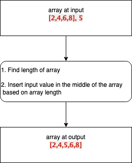
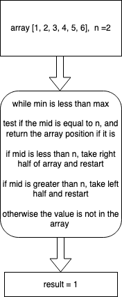

# Array Challenges

1. Reverse an Array

Input: [1, 2, 3, 4]

Output:[4, 3, 2, 1]

2. Shift an Array

Input: [1, 2, 4], 3

Output:[1, 2, 3, 4]

3. Binary Search

Input: [1, 2, 3, 4, 5], 4

Output: 3

