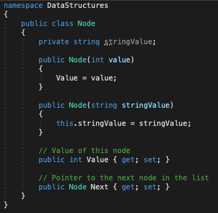
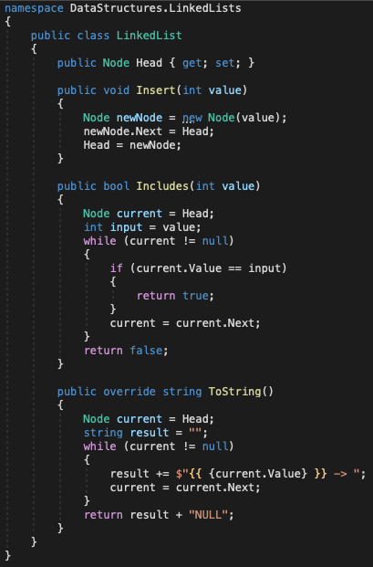

# DSA

## Linked Lists

*Author: Enrique Hilst*

----

## Description
This is a C# console application that will created linked lists and run tests to check whether nodes have been properly created.
---

### Getting Started
Clone this repository to your local machine.

```
$ git clone https://github.com/ehilst515/data-structures-and-algorithms.git
```

### To run the program from Visual Studio:
Select ```File``` -> ```Open``` -> ```Project/Solution```

Next navigate to the location you cloned the Repository.

Double click on the ```dotnet-data-structures-and-algorithms``` directory.

Then select and open ```DSA.sln```.

Run the projects and unit tests.

---

### Visuals


